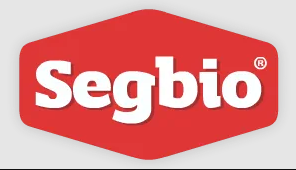
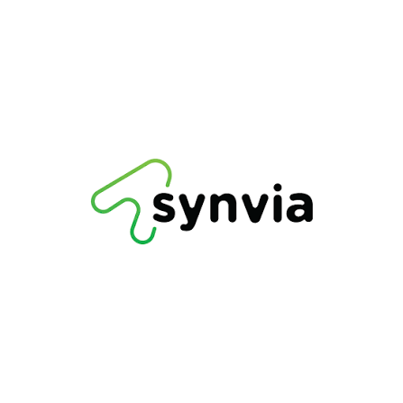

### Experiência de trabalho

Na visão geral abaixo você encontrará minha experiência de trabalho mais recente:

**Engenheiro de Software** \
[**RS Solutions**](#) • Tempo integral • out/2024 - o momento \
Linguagens & Tecnologias: `React.js`, `AWS`, `Node`, `TypeScript` \
Campinas, São Paulo, Brasil
 

**UI Developer** \
[**Segbio Equipamentos de Segurança**](#) • Tempo integral • jan/2024 - set/2024 \
Linguagens & Tecnologias: `Adobe Photoshop`, `Motion Design`, `HTML`, `CSS` \
Campinas, São Paulo, Brasil
 

**Desenvolvedor Full Stack** \
[**Synvia**](#) • Híbrido • jan/2023 - dez/2023 \
Linguagens & Tecnologias: `JavaScript`, `React`, `SQL`, `AWS`, `HTML`, `CSS` \
Paulínia, São Paulo, Brasil
 
 
  <picture>
  <source
    media="(prefers-color-scheme: dark)"
    srcset="https://raw.githubusercontent.com/platane/snk/output/github-contribution-grid-snake-dark.svg"
  />
  <source
    media="(prefers-color-scheme: light)"
    srcset="https://raw.githubusercontent.com/platane/snk/output/github-contribution-grid-snake.svg"
  />
  
</picture>
  
